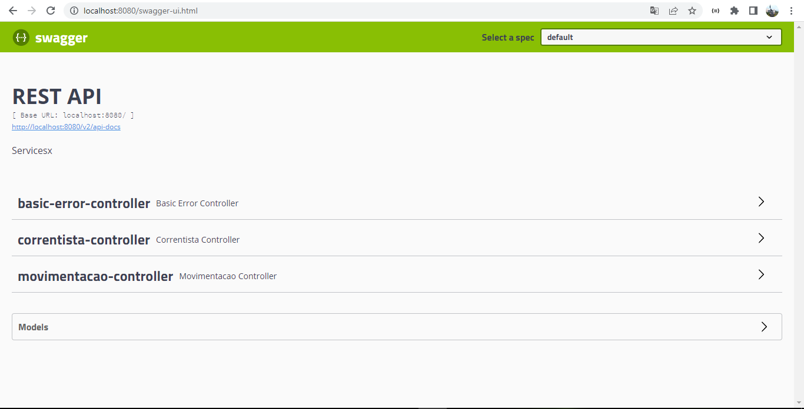
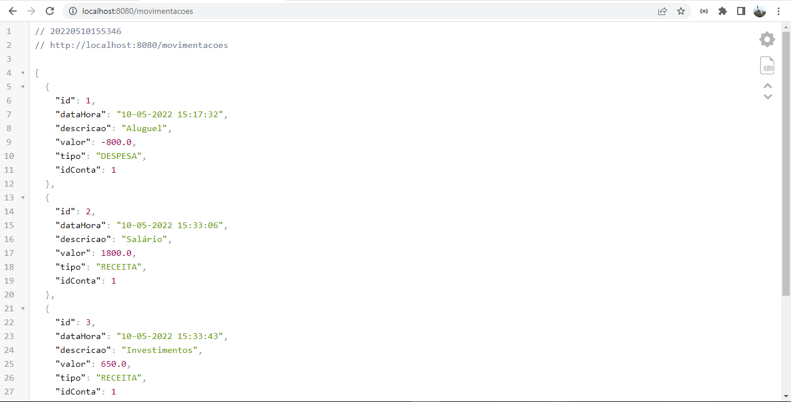

<h1 align="center">Bank API</h1>

<h1 align="center">
  
   
  
  
  
</h1>

### Sobre :book:
 API feita durante a SANTANDER DEV WEEK com o objetivo de simular o back-end de um banco, utilizando Spring Boot, Java e documentada com o Swagger. Foi usada para a criação do aplicativo bank app no repositório : https://github.com/andreesperanca/bank-app
 

 ### Tecnologias :rocket:

 - Java 
 - Intellij IDEA
 - Spring Boot
 - Swagger
 
 ### Funcionalidades 🛠

- [x] GET/POST MOVIMENTAÇÕES
- [x] GET/POST CORRENTISTAS
- [x] DOCUMENTAÇÃO UTILIZANDO SWAGGER 

### Autor

Feito com por André Esperança!

Contatos :
 

<a href="https://github.com/andreesperanca">
   
 
  
  <a href="https://github.com/andreesperanca" title="">André Esperança</a>

